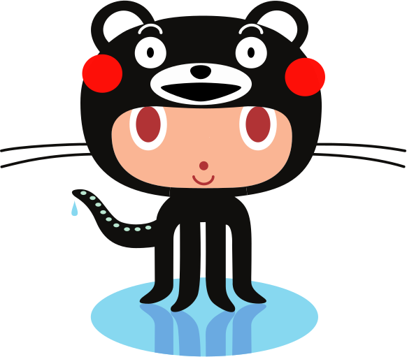

# Octobear

## ライセンス

OctobearはOctocatおよびくまモンの複合著作物です。
ライセンスはOctcatおよびくまモンのライセンスに準じます。

個人利用の場合、ブログやSNSのアバターなどGitHubや熊本県への愛を示すための用途で利用することができます。

商用利用はちょっと難しいです。
熊本県に[利用申請](https://kumamon-official.jp/application)した上で、GitHubへのリンクを表す用途で利用可能です。
詳細は各ライセンスをご確認ください。

## 参考

* [Octdex FAQ](https://octodex.github.com/faq.html)

> Q: Can I use an octocat as my avatar?
> You can use an octocat as your personal avatar, but not for your company or a product you're building. You are welcome to show your <3 for GitHub, but not appear as if you == GitHub.

* [くまモン利用申請 ーよくある質問ー](https://kumamon-official.jp/faq)
> Q: 個人が利用する場合でも、利用申請が必要となるか。
> 以下に例示するような場合は必要ありません。
> 
> (1)個人のツイッターやフェイスブック、LINE等のSNSのトップ画面に、くまモンのイラスト(又は写真)を利用する場合
> (2)個人のSNSやHP、ブログなどの記事としてくまモンのイラスト(又は写真)を掲載する場合
> (3)ランニング仲間数人が揃いの(既成の)くまモンTシャツを着て練習や試合に出ること
> (4)営利目的ではないが、自分で作ったくまモンのマスコットを、制作経費だけもらって身内にプレゼントする場合
> (5)個人で楽しむ事を目的に自分で作ったくまモンのマスコット等を、自分のブログなどに掲載する場合
> 
> 個人利用の場合でも、著作権の表記は行ってください。　
> 日本語表記　©2010熊本県くまモン
> 外国語表記　©2010 kumamoto pref. kumamon

